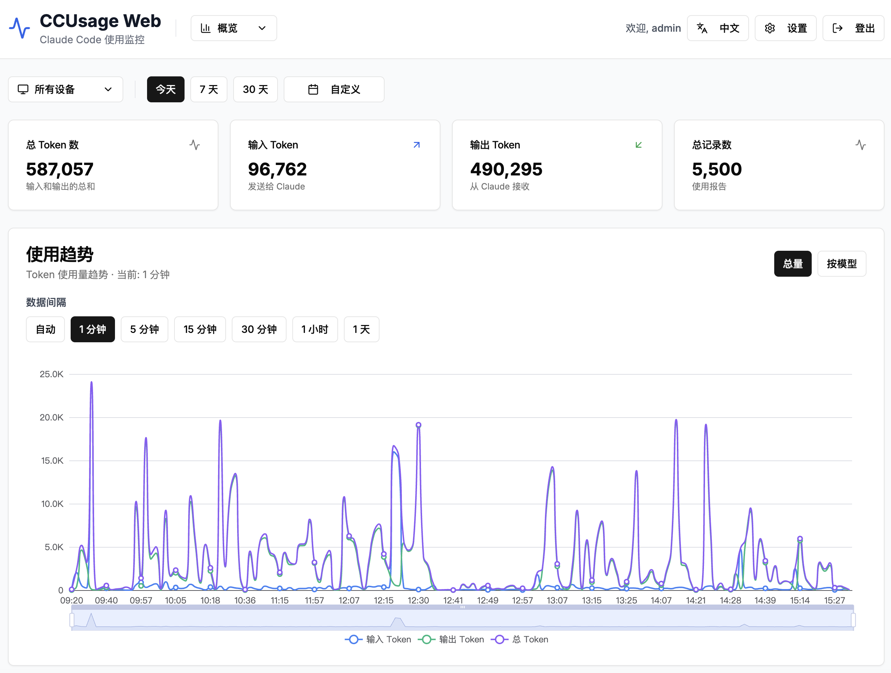
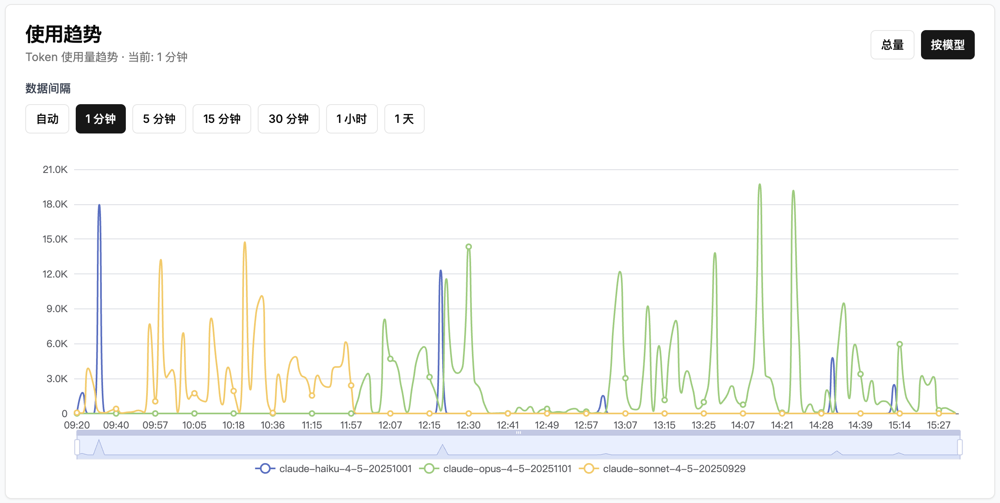
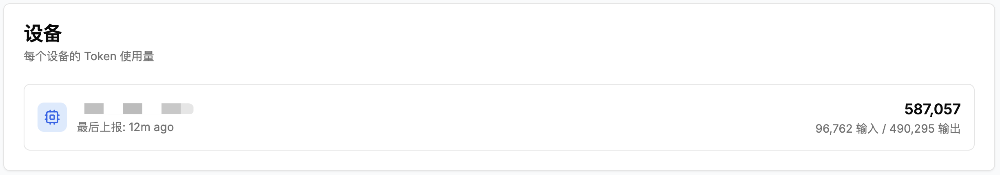
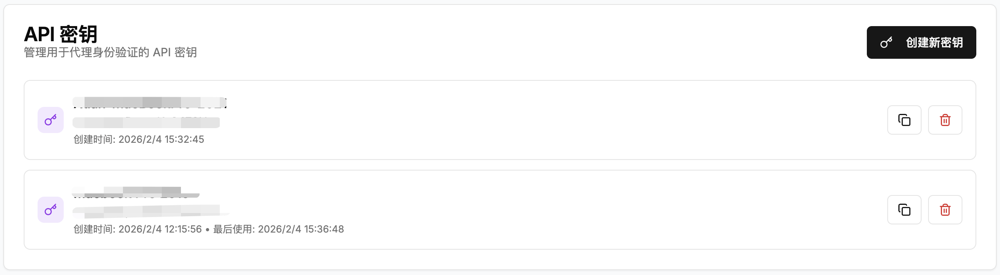
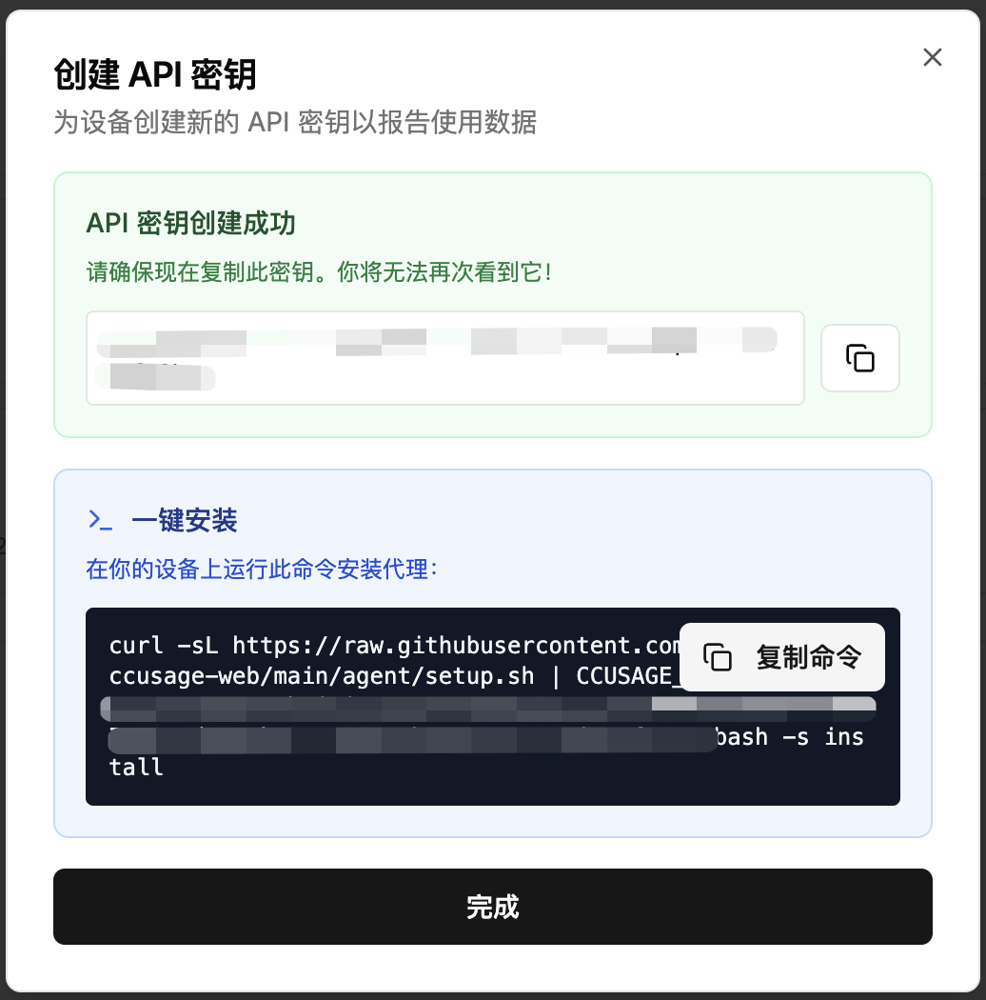

# CCUsage Web

一个基于 Web 的 Claude Code token 用量监控仪表板，支持多设备监控。

[English Documentation](README.md)

## 功能特性

- 🌍 **完整的国际化支持** - 完整的中英文本地化
- 📊 **实时 token 用量监控** - 跨设备追踪 Claude Code 使用情况
- 🖥️ **多设备支持** - 基于 Agent 的多机器数据上报
- 🔐 **安全认证** - 基于 JWT 的管理员系统，支持密码管理
- 📈 **交互式仪表板** - 精美的图表展示用量统计和趋势
- 🔑 **API 密钥管理** - 创建和管理设备专属 API 密钥
- ⚙️ **设置面板** - 修改密码和管理账户设置
- 🚀 **Docker 就绪** - 一键使用 docker-compose 部署
- 💾 **SQLite 数据库** - 自动初始化和数据持久化
- 📱 **响应式设计** - 在桌面和移动设备上完美运行

## 技术栈

- **前端**: Next.js 15 (App Router), React 19, TypeScript
- **UI**: shadcn/ui, Tailwind CSS, Recharts
- **国际化**: next-intl 实现多语言支持
- **后端**: Next.js API Routes
- **数据库**: SQLite (better-sqlite3)
- **认证**: JWT + bcrypt 密码哈希
- **部署**: Docker + docker-compose

## 快速开始

### 步骤 1: 部署服务器（管理员操作）

首先需要搭建监控服务器：

#### 方式 A: Docker 部署（推荐）

1. 下载部署文件：
```bash
mkdir ccusage-web && cd ccusage-web
curl -sL https://raw.githubusercontent.com/jx453331958/ccusage-web/main/deploy.sh -o deploy.sh
curl -sL https://raw.githubusercontent.com/jx453331958/ccusage-web/main/docker-compose.yml -o docker-compose.yml
curl -sL https://raw.githubusercontent.com/jx453331958/ccusage-web/main/.env.example -o .env.example
chmod +x deploy.sh
```

2. 一键部署：
```bash
./deploy.sh deploy
```

脚本会自动：
- 检查 Docker 是否可用
- 创建 `.env` 文件（会提示你编辑配置）
- 创建数据目录
- 从 ghcr.io 拉取预构建镜像并启动容器

3. 访问仪表板 http://localhost:3000
   - 使用配置的凭据登录
   - SQLite 数据库存储在 `./data/ccusage.db`

#### 部署脚本命令

```bash
./deploy.sh deploy   # 首次部署
./deploy.sh update   # 拉取最新镜像并重启
./deploy.sh start    # 启动服务
./deploy.sh stop     # 停止服务
./deploy.sh restart  # 重启服务
./deploy.sh status   # 查看状态和最近日志
./deploy.sh logs     # 查看实时日志
./deploy.sh backup   # 备份数据库
./deploy.sh clean    # 删除容器和镜像
```

#### 手动 Docker 部署

如果你更喜欢手动配置：

1. 配置环境变量：
```bash
cp .env.example .env
nano .env  # 编辑配置
```

推荐的 `.env` 配置：
```bash
ADMIN_USERNAME=admin
ADMIN_PASSWORD=你的安全密码
COOKIE_SECURE=false  # 如果使用 HTTPS 请设为 true
```

2. 使用 Docker Compose 启动：
```bash
docker compose pull
docker compose up -d
```

3. 访问仪表板 http://localhost:3000

#### 方式 B: 开发模式部署

1. 克隆并安装：
```bash
git clone git@github.com:jx453331958/ccusage-web.git
cd ccusage-web
npm install
```

2. 配置环境变量：
```bash
cp .env.example .env
nano .env  # 编辑凭据
```

3. 启动开发服务器：
```bash
npm run dev
```

4. 访问 http://localhost:3000

### 步骤 2: 安装 Agent（用户操作）

服务器运行后，用户可以安装监控 agent：

1. **从管理员获取凭据：**
   - 服务器地址（例如：`http://your-server:3000`）
   - API 密钥（在仪表板 → API Keys 标签页创建）

2. **一键安装（通过环境变量）：**
```bash
curl -sL https://raw.githubusercontent.com/jx453331958/ccusage-web/main/agent/setup.sh | \
  CCUSAGE_SERVER=http://your-server:3000 CCUSAGE_API_KEY=your-key bash -s install
```

或者 **下载后交互式运行：**
```bash
curl -sL https://raw.githubusercontent.com/jx453331958/ccusage-web/main/agent/setup.sh -o setup.sh
chmod +x setup.sh
./setup.sh install
```

脚本会：
- 自动检测操作系统（macOS/Linux）
- 安装为后台服务（launchd/systemd/cron）
- 开始每 5 分钟上报一次使用数据

**就这么简单！** Agent 在后台运行，自动向服务器上报数据。

## Agent 管理

### 一键安装

```bash
curl -sL https://raw.githubusercontent.com/jx453331958/ccusage-web/main/agent/setup.sh | \
  CCUSAGE_SERVER=http://your-server:3000 \
  CCUSAGE_API_KEY=your-api-key \
  REPORT_INTERVAL=5 \
  bash -s install
```

### 查看 Agent 状态

```bash
curl -sL https://raw.githubusercontent.com/jx453331958/ccusage-web/main/agent/setup.sh | bash -s status
```

### 更新 Agent

```bash
curl -sL https://raw.githubusercontent.com/jx453331958/ccusage-web/main/agent/setup.sh | bash -s update
```

### 重启 Agent

```bash
curl -sL https://raw.githubusercontent.com/jx453331958/ccusage-web/main/agent/setup.sh | bash -s restart
```

### 卸载 Agent

```bash
curl -sL https://raw.githubusercontent.com/jx453331958/ccusage-web/main/agent/setup.sh | bash -s uninstall
```

### 推荐方式：先下载脚本

如果你想先下载脚本，然后多次使用：

```bash
curl -sL https://raw.githubusercontent.com/jx453331958/ccusage-web/main/agent/setup.sh -o setup.sh
chmod +x setup.sh
./setup.sh install    # 安装 agent
./setup.sh status     # 查看状态
./setup.sh update     # 更新到最新版本
./setup.sh restart    # 重启服务
./setup.sh reset      # 清除本地状态，重新上报所有数据
./setup.sh config     # 编辑配置文件
./setup.sh run        # 测试运行一次
./setup.sh uninstall  # 卸载 agent
```

### 配置文件

Agent 的配置存储在 `~/.ccusage-agent.conf`：

```bash
# 编辑配置
./setup.sh config

# 重启以应用更改
./setup.sh restart
```

查看 [agent/README.md](agent/README.md) 了解手动配置和高级选项。

## API 文档

### 认证

所有管理员端点都需要 JWT token（作为 HTTP-only cookie）。

**登录**
```http
POST /api/auth/login
Content-Type: application/json

{
  "username": "admin",
  "password": "admin123"
}
```

**登出**
```http
POST /api/auth/logout
```

**修改密码**
```http
POST /api/auth/change-password
Cookie: auth_token=JWT_TOKEN
Content-Type: application/json

{
  "currentPassword": "admin123",
  "newPassword": "newpassword123"
}
```

### 用量上报（Agent API）

**上报用量**
```http
POST /api/usage/report
Authorization: Bearer 你的API密钥
Content-Type: application/json

{
  "records": [
    {
      "input_tokens": 1000,
      "output_tokens": 500,
      "cache_write_tokens": 200,
      "cache_read_tokens": 800,
      "total_tokens": 2500,
      "session_id": "可选的会话ID",
      "timestamp": 1234567890
    }
  ]
}
```

### 统计数据

**获取用量统计**
```http
GET /api/usage/stats?range=7d
Cookie: auth_token=JWT_TOKEN
```

查询参数:
- `range`: `1d`, `7d`, `30d`, 或 `all`

### API Key 管理

**列出 API Keys**
```http
GET /api/api-keys
Cookie: auth_token=JWT_TOKEN
```

**创建 API Key**
```http
POST /api/api-keys
Cookie: auth_token=JWT_TOKEN
Content-Type: application/json

{
  "device_name": "MacBook Pro"
}
```

**删除 API Key**
```http
DELETE /api/api-keys/:id
Cookie: auth_token=JWT_TOKEN
```

## 环境变量

| 变量 | 说明 | 默认值 |
|------|------|--------|
| `DATABASE_PATH` | SQLite 数据库路径 | `./data/ccusage.db` |
| `ADMIN_USERNAME` | 默认管理员用户名 | `admin` |
| `ADMIN_PASSWORD` | 默认管理员密码 | `admin123` |
| `COOKIE_SECURE` | 启用安全 Cookie (HTTPS) | `false` |
| `PORT` | 服务器端口 | `3000` |

## 项目结构

```
ccusage-web/
├── src/
│   ├── app/                 # Next.js App Router 页面
│   │   ├── api/            # API 路由
│   │   │   ├── auth/      # 认证端点
│   │   │   ├── api-keys/  # API 密钥管理
│   │   │   ├── usage/     # 用量上报和统计
│   │   │   └── locale/    # 语言偏好设置
│   │   ├── dashboard/      # 仪表板页面
│   │   ├── login/          # 登录页面
│   │   └── settings/       # 设置页面
│   ├── components/         # UI 组件
│   │   ├── ui/            # shadcn/ui 组件
│   │   ├── dashboard/     # 仪表板专用组件
│   │   └── settings/      # 设置页面专用组件
│   └── lib/               # 工具库
│       ├── db.ts          # 数据库设置
│       ├── auth.ts        # 认证
│       ├── locale.ts      # 国际化辅助函数
│       └── utils.ts       # 辅助函数
├── messages/              # 国际化翻译文件
│   ├── en.json           # 英文翻译
│   └── zh.json           # 中文翻译
├── agent/                 # 监控 Agent 脚本
├── data/                  # SQLite 数据库（自动创建）
├── Dockerfile            # Docker 配置
└── docker-compose.yml    # Docker Compose 配置
```

## 截图

### 仪表盘概览


### 按模型分类的使用趋势


### 多设备支持


### API 密钥管理


### 一键安装代理


## 许可证

MIT License
